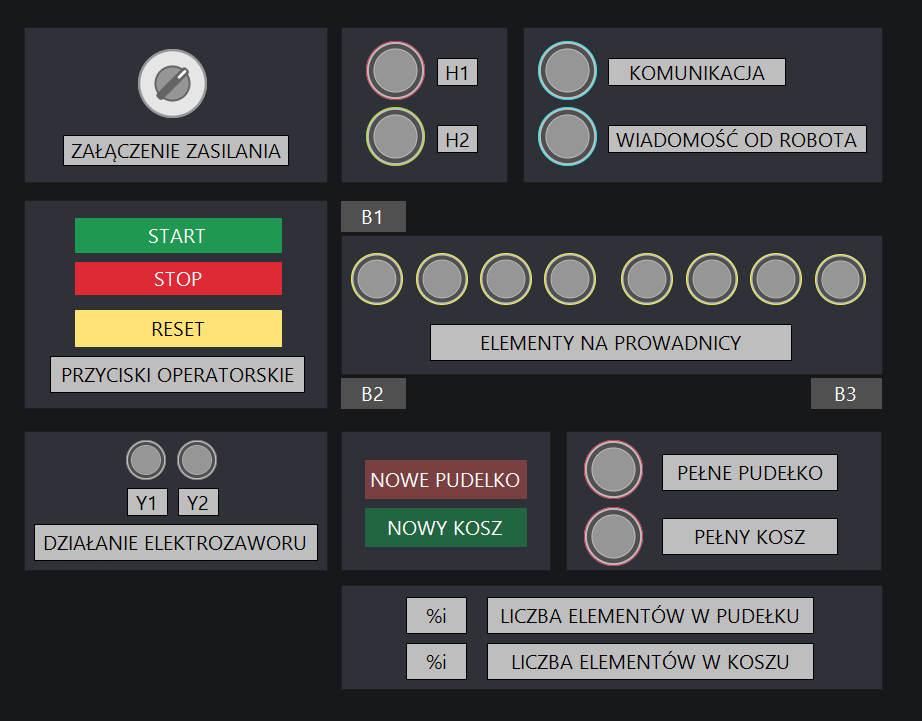
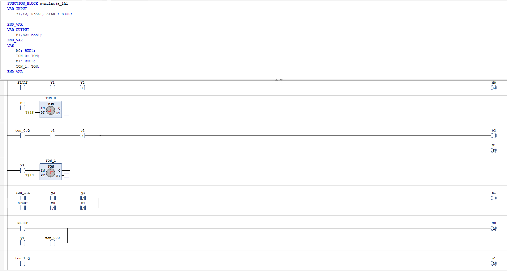

# Zrobotyzowane stanowisko segregacji elementów - Integracja PLC z robotem SCARA przez TCP/IP

## 📋 Opis Projektu

Głównym celem układu jest transport detali z podajnika, identyfikacja materiału (metal/niemetal) oraz odpowiednie posortowanie ich przy użyciu **robota przemysłowego**. Układ śledzi pozycję detali na taśmie za pomocą rejestru przesuwnego **SHL** i zlicza elementy, zatrzymując pracę po zapełnieniu pojemników.

## 🎥 Prezentacja Działania Układu

## 🖥️ Wykorzystane środowiska

* **CODESYS v3.5 SP21** – Opracowanie logiki sterowania dla PLC, konfiguracja **SoftPLC**, stworzenie wizualizacji **HMI** oraz implementacja **klienta TCP/IP** do komunikacji z robotem.
* **EPSON RC+ 8.0** – Programowanie robota przemysłowego w języku **SPEL+** oraz symulacja cyklu pracy i trajektorii ruchu.
* **Autodesk Inventor** – Projektowanie mechaniczne, **modelowanie 3D** stanowiska oraz rozmieszczenie czujników i elementów wykonawczych.

## 🛠️ Budowa stanowiska
### Elementy wykonawcze
* **Siłownik pneumatyczny:** Dwustronnego działania, służy do spychania detali z podajnika na prowadnicę.
* **Zawór 1V1:** Elektrozawór 5/2 bistabilny sterujący siłownikiem.
* **Robot przemysłowy typu SCARA:** Odpowiedzialny za pick & place do odpowiednich pojemników.

### Czujniki
| Oznaczenie | Typ | Funkcja |
|:---:|:---|:---|
| **1B1** | Kontaktron | Wykrywa maksymalne wsunięcie tłoczyska siłownika. |
| **1B2** | Kontaktron | Wykrywa maksymalne wysunięcie tłoczyska siłownika. |
| **B1** | Indukcyjny | Wykrywa elementy metalowe. |
| **B2** | Zbliżeniowy | Wykrywa obecność detalu na początku prowadnicy. |
| **B3** | Zbliżeniowy | Wykrywa obecność detalu na końcu prowadnicy. |

## ⚙️ Zasada działania

Główna sekwencja sterująca została zrealizowana przy użyciu architektury **Maszyny Stanów** w języku **Structured Text**.

* **Implementacja:** Wykorzystanie instrukcji `CASE ... OF`.
* **Zalety:**
    * Wyeliminowanie nieprzewidzianych stanów.
    * Łatwa rozbudowa o nowe kroki.
    * Przejrzysta obsługa błędów i zatrzymań awaryjnych.
* **Główne stany:** `POWER OFF`, `POWER ON`, `PRACA`, `RUCH ROBOTA`, `PEŁNE PUDEŁKO/KOSZ`.

Proces sterowania został zaimplementowany w Soft PLC.

1.  **Inicjalizacja:** Przełącznik `DI_xON` załącza zasilanie. Układ oczekuje na przycisk `START`.
2.  **Podawanie:** Po sygnale START i wykryciu detalu w magazynku (B2), zawór `1V1` przesterowuje siłownik, wypychając detal.
3.  **Detekcja:**
    * Podczas przesuwu czujnik **B1** sprawdza materiał.
    * Wykrycie metalu zapala żółtą lampkę na HMI i wpisuje `1` do rejestru przesuwnego.
4.  **Śledzenie:** Rejestr przesuwny `SHL` przesuwa bity w takt przemieszczania się detali, pamiętając, który detal jest metalowy.
5.  **Segregacja (Robot):**
    * Gdy detal dotrze do czujnika **B3**, PLC wysyła sygnał do robota.
    * Na podstawie bitu z rejestru, robot otrzymuje komendę aby odłożyć element w zależności od wykonanego materiału. Jeśli jest on wykonany z metalu to odkłada go do pudełka, natomiast jeśli on jest niemetalowy odkłada go do kosza.
6.  **Handshake:** Robot po wykonaniu ruchu wysyła sygnał zwrotny "MOVE_DONE", co zezwala na dalszą pracę układu.
7.  **Zliczanie:**
    * **Pudełko:** Max 4 sztuki.
    * **Kosz:** Max 9 sztuk.
    * Osiągnięcie limitu zapala lampkę na HMI i wstrzymuje proces do momentu opróżnienia (Reset licznika).

## 🌐 Komunikacja (TCP/IP)

Do wymiany danych między sterownikiem a robotem wykorzystano protokół TCP/IP.
* **Biblioteka:** `CAA Net Base Services` (NBS).
* **Implementacja:**
    * Wykorzystanie bloku funkcyjnego **`NBS.TCP_Client`** do nawiązania połączenia z kontrolerem robota działającym jako Server.
    * Obsługa strumienia danych za pomocą bloków **`NBS.TCP_Write`** oraz **`NBS.TCP_Read`**.
    * Asynchroniczna wymiana danych w cyklu sterownika.

## 📊 Wizualizacja HMI

Panel operatorski realizuje następujące funkcje:
* Przyciski sterujące: START, STOP, Reset symulacji.
* Lampki sygnalizacyjne: Sygnalizacja pracy układu.
* Lampka żółta: Sygnalizacja wykrycia metalu w bieżącym cyklu.
* Lampki alarmowe: Sygnalizacja pełnego Kosza lub Pudełka.
  

## 🤖 Symulacja działania układu - Cyfrowy bliźniak

Aby umożliwić testowanie logiki bez fizycznego dostępu do komponentów pneumatycznych, zaimplementowano blok symulacji siłownika **1A1** w języku **LADDER (LD)**.

### Funkcjonalność bloku `symulacja_1A1`:
* **Modelowanie ruchu:** Symuluje czas wysuwu i powrotu tłoka.
* **Wirtualne czujniki:** Generuje sygnały zwrotne `1B1` i `1B2` na podstawie stanu cewek `Y1`/`Y2`.
* **Interakcja:** Reaguje na sygnały `RESET` oraz `START` zasilania.

Projekt został zintegrowany z symulatorem robota SCARA w środowisku **Epson RC+ 8.0**. Dzięki temu możliwe było pełne przetestowanie ścieżek ruchu robota oraz wymiany sygnałów I/O między sterownikiem PLC a kontrolerem robota.

### Symulacja
* **Wizualizacja 3D:** Pełny podgląd ruchu ramienia robota w czasie rzeczywistym.
* **Komunikacja:** Obsługa komend (np. `iCommand: 1` -> Pick & Place do pudełka).
* **Synchronizacja:** Robot przesyła sygnał zwrotny `From_Rob` po zakończeniu cyklu, co pozwala PLC na przejście do kolejnego kroku.

